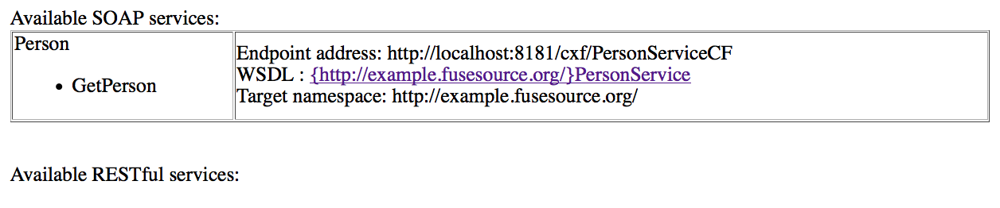

Helloworld Fuse
===============

This is a simple Helloworld WebService based on CXF

Setup Fuse Installation
=======================

TODO: [move to a common file FUSE-SETUP.md]

unzip a jboss-fuse distribution on your filesystem

    unzip jboss-fuse-full-x.y.z.redhat-nnn.zip

    cd jboss-fuse-full-x.y.z.redhat-nnn/etc

    vi users.properties

uncomment last line:

    admin=admin,admin

then you can start the container with

    <INSTALL_DIR>/bin/start

Project description
===================

* Spring config

check the file

    cxf-hello-world/src/main/resources/META-INF/spring/beans.xml

it contains the WS info

    <jaxws:endpoint id="HTTPEndpoint"
        implementor="org.fusesource.example.PersonImpl"
        address="/PersonServiceCF"/>

The jaxws:endpoint element creates the WS endpoint, it requires two attributes, as follows:

implementor: Specifies the class that implements the Service Endpoint Interface (SEI).

address: Specifies the WS endpoint address.

In this example, instead of a HTTP URL, the address is specified as a
relative path. In the context of JBoss Fuse, this is taken to mean that the Web service should be installed into the
JBoss Fuse container's default Jetty container.

By default, the specified path gets prefixed by

    http://localhost:8181/cxf/

so the actual address of the Web service becomes:

    http://localhost:8181/cxf/PersonServiceCF

build a generic project from scratch
====================================

mvn:

    mvn archetype:generate -DarchetypeGroupId=org.apache.servicemix.tooling -DarchetypeArtifactId=servicemix-cxf-code-first-osgi-bundle -DarchetypeVersion=2013.01.0.redhat-610379 -DgroupId=org.fusesource.example -DartifactId=cxf-hello-world -Dversion=1.0-SNAPSHOT -s maven-settings.xml

NOTE:

Int the command we used:

    -s maven-setting.xml

this contains the fuse maven repo

Trouble shooting:

It may happens in the future that the:

	servicemix-cxf-code-first-osgi-bundle

version:

	2013.01.0.redhat-610379

will no longer be available, so check the version on fuse public maven repository.

Build the project 
=================

    mvn clean install

Wait for the first build

This will install the hello world project in your local maven repository

Connect to fuse and Install the bundle
======================================

With fuse started, now you can do:

    ssh -o UserKnownHostsFile=/dev/null -p 8101 admin@localhost

NOTE: with the option -o UserKnownHostsFile=/dev/null you are always connecting with a new ssh knownhostfile this is
helpfull when you do a stop/restart fuse server from different networks as it may changes the pair ip/publickey.

you should get some info on the new ssh host

    The authenticity of host '[localhost]:8101 ([::1]:8101)' can't be established.
    DSA key fingerprint is 21:41:51:1d:01:d1:a1:b1:81:01:a1:aa:ba:1d:61:b1.
    Are you sure you want to continue connecting (yes/no)? yes
    Warning: Permanently added '[localhost]:8101' (DSA) to the list of known hosts.
    Authenticated with partial success.
    Authenticated with partial success.
    Authenticated with partial success.
    Password authentication
    Password:

You should get a welcome screen like this:

         _ ____                  ______
         | |  _ \                |  ____|
         | | |_) | ___  ___ ___  | |__ _   _ ___  ___
     _   | |  _ < / _ \/ __/ __| |  __| | | / __|/ _ \
    | |__| | |_) | (_) \__ \__ \ | |  | |_| \__ \  __/
     \____/|____/ \___/|___/___/ |_|   \__,_|___/\___|

      JBoss Fuse (6.1.0.redhat-379)
      http://www.redhat.com/products/jbossenterprisemiddleware/fuse/

    Hit '<tab>' for a list of available commands
    and '[cmd] --help' for help on a specific command.

    Open a browser to http://localhost:8181 to access the management console

    Create a new Fabric via 'fabric:create'
    or join an existing Fabric via 'fabric:join [someUrls]'

    Hit '<ctrl-d>' or 'osgi:shutdown' to shutdown JBoss Fuse.

    JBossFuse:admin@root>

list the bundles:

    JBossFuse:admin@root> list

this will output a list of bundles like:

    START LEVEL 100 , List Threshold: 50
       ID   State         Blueprint      Spring    Level  Name
    [  66] [Active     ] [Created     ] [       ] [   50] Fabric8 :: Karaf Commands (1.0.0.redhat-379)
    [  67] [Active     ] [            ] [       ] [   50] Fabric8 :: ConfigAdmin Bridge (1.0.0.redhat-379)
    [  68] [Active     ] [Created     ] [       ] [   50] JBoss Fuse :: ESB :: Commands (6.1.0.redhat-379)
    [  83] [Active     ] [            ] [       ] [   60] Guava: Google Core Libraries for Java (15.0.0)
    [  84] [Active     ] [            ] [       ] [   60] Fabric8 :: Groups (1.0.0.redhat-379)
    [  85] [Active     ] [            ] [       ] [   60] Fabric8 :: Git (1.0.0.redhat-379)
    [  86] [Active     ] [Created     ] [       ] [   60] Fabric8 :: JAAS (1.0.0.redhat-379)
    [...]

we can install previously built cfx-hello-world

    JBossFuse:admin@root> install mvn:org.fusesource.example/cxf-hello-world/1.0-SNAPSHOT

this output (maybe with a different ID) the bundle ID

    Bundle ID: 251

now we can start our bundle with ID 251

    JBossFuse:admin@root> start 251

now if we do:

    JBossFuse:admin@root> list

the last entry of the list shows our bundle:

    [ 251] [Active     ] [            ] [Started] [   60] Apache ServiceMix :: CXF Code First OSGi Bundle (1.0.0.SNAPSHOT)

We can check out WebService WSDL at:

    http://localhost:8181/cxf/PersonServiceCF?wsdl

We can see the developed web services going at:

    http://localhost:8181/cxf/

It will show:

Test with client
================

We can call our WebService using maven:

    mvn -Pclient

This will use the pom.xml's client profile to run the class:

    org.fusesource.example.client.Client

the output is:

    [...]
    [INFO] --- exec-maven-plugin:1.2.1:java (default) @ cxf-hello-world ---
    May 05, 2014 3:01:22 PM org.apache.cxf.service.factory.ReflectionServiceFactoryBean buildServiceFromClass
    INFO: Creating Service {http://example.fusesource.org/}PersonService from class org.fusesource.example.Person
    Invoking getPerson...
    getPerson._getPerson_personId=Guillaume
    getPerson._getPerson_ssn=000-000-0000
    getPerson._getPerson_name=Guillaume
    [INFO] ------------------------------------------------------------------------
    [INFO] BUILD SUCCESS
    [INFO] ------------------------------------------------------------------------
    [...]

Automagically bundles config: the pom.xml
=========================================

The pom xml is configured to setup and package the bundle.

    <plugin>
        <groupId>org.apache.felix</groupId>
        <artifactId>maven-bundle-plugin</artifactId>
        <version>2.3.6</version>
        <extensions>true</extensions>
        <configuration>
            <instructions>
                <Bundle-SymbolicName>${project.artifactId}</Bundle-SymbolicName>
                <Import-Package>
                    javax.jws,
                    javax.wsdl,
                    javax.xml.bind,
                    javax.xml.bind.annotation,
                    javax.xml.namespace,
                    javax.xml.ws,
                    META-INF.cxf,
                    META-INF.cxf.osgi,
                    org.apache.cxf.bus,
                    org.apache.cxf.bus.spring,
                    org.apache.cxf.bus.resource,
                    org.apache.cxf.configuration.spring,
                    org.apache.cxf.resource,
                    org.apache.cxf.jaxws,
                    org.apache.cxf.transport.http,
                    org.springframework.beans.factory.config
                </Import-Package>
                <Private-Package>
                    !org.fusesource.example.client,
                    org.fusesource.example,
                    org.fusesource.example.types
                </Private-Package>
                <Require-Bundle>org.apache.cxf.bundle</Require-Bundle>
            </instructions>
        </configuration>
    </plugin>

This makes maven setups the manifest file in the jar with these values:

    Manifest-Version: 1.0
    Bnd-LastModified: 1399293310990
    Build-Jdk: 1.7.0_25
    Built-By: jbdev
    Bundle-ManifestVersion: 2
    Bundle-Name: Apache ServiceMix :: CXF Code First OSGi Bundle
    Bundle-SymbolicName: cxf-hello-world
    Bundle-Version: 1.0.0.SNAPSHOT
    Created-By: Apache Maven Bundle Plugin
    Export-Package: org.fusesource.example.client;uses:="org.fusesource.exam
     ple,org.apache.cxf.jaxws,javax.xml.ws";version="1.0.0.SNAPSHOT",org.fus
     esource.example;uses:="javax.jws,javax.xml.bind.annotation,org.fusesour
     ce.example.types,javax.xml.ws";version="1.0.0.SNAPSHOT",org.fusesource.
     example.types;uses:="javax.xml.bind.annotation";version="1.0.0.SNAPSHOT
     "
    Import-Package: META-INF.cxf;version="[2.7,3)",META-INF.cxf.osgi;version
     ="[2.7,3)",javax.jws;version="[2.0,3)",javax.wsdl,javax.xml.bind,javax.
     xml.bind.annotation,javax.xml.namespace,javax.xml.ws;version="[2.2,3)",
     org.apache.cxf.bus;version="[2.7,3)",org.apache.cxf.bus.resource;versio
     n="[2.7,3)",org.apache.cxf.bus.spring;version="[2.7,3)",org.apache.cxf.
     configuration.spring;version="[2.7,3)",org.apache.cxf.jaxws;version="[2
     .7,3)",org.apache.cxf.resource;version="[2.7,3)",org.apache.cxf.transpo
     rt.http;version="[2.7,3)",org.springframework.beans.factory.config
    Require-Bundle: org.apache.cxf.bundle
    Tool: Bnd-1.50.0