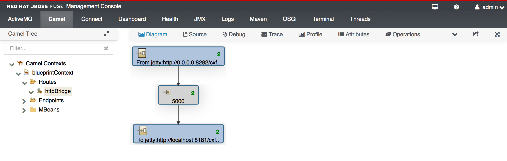

Helloworld Fuse
===============

This is a simple Helloworld for camel

This example will NOT USE Fabric

NOTE: this project depends on cxf-hello-world example

Setup Fuse Installation
=======================

TODO: [move to a common file FUSE-SETUP.md]

unzip a jboss-fuse distribution on your filesystem

    unzip jboss-fuse-full-x.y.z.redhat-nnn.zip

    cd jboss-fuse-full-x.y.z.redhat-nnn/etc

    vi users.properties

uncomment last line:

    admin=admin,admin

then you can start the container with

    <INSTALL_DIR>/bin/start

Project description
===================

This is a simple project to play with camel routes using the cxf-hello-world example

Camel routes
============

The routes are described in the file:

    camel-hello-world/src/main/resources/OSGI-INF/blueprint/blueprint.xml

this is a blueprint config file:

    [...]
    <camelContext id="blueprintContext" trace="false" xmlns="http://camel.apache.org/schema/blueprint">
            <route id="httpBridge">
                <from uri="jetty:http://0.0.0.0:8282/cxf/PersonServiceCF?matchOnUriPrefix=true"/>
                <delay>
                    <constant>5000</constant>
                </delay>
                <to uri="jetty:http://localhost:8181/cxf/PersonServiceCF?bridgeEndpoint=true&amp;throwExceptionOnFailure=false"/>
            </route>
    </camelContext>
    [...]

This example works as http bridge between the client and the webservice contained in cxf-hello-world

build a generic project from scratch
====================================

mvn:

    mvn archetype:generate -DarchetypeGroupId=org.apache.camel.archetypes -DarchetypeArtifactId=camel-archetype-blueprint -DarchetypeVersion=2.12.0.redhat-610379 -DgroupId=org.fusesource.example -DartifactId=camel-hello-world -Dversion=1.0-SNAPSHOT -s maven-settings.xml

NOTE:

Int the command we used:

    -s maven-setting.xml

this contains the fuse maven repo

Build the project 
=================

    mvn clean install

Wait for the first build

This will install the hello world project in your local maven repository

Connect to fuse and Install the bundle
======================================

With fuse started, now you can do:

    ssh -o UserKnownHostsFile=/dev/null -p 8101 admin@localhost

NOTE: with the option -o UserKnownHostsFile=/dev/null you are always connecting with a new ssh knownhostfile this is
helpfull when you do a stop/restart fuse server from different networks as it may changes the pair ip/publickey.

you should get some info on the new ssh host

    The authenticity of host '[localhost]:8101 ([::1]:8101)' can't be established.
    DSA key fingerprint is 21:41:51:1d:01:d1:a1:b1:81:01:a1:aa:ba:1d:61:b1.
    Are you sure you want to continue connecting (yes/no)? yes
    Warning: Permanently added '[localhost]:8101' (DSA) to the list of known hosts.
    Authenticated with partial success.
    Authenticated with partial success.
    Authenticated with partial success.
    Password authentication
    Password:

You should get a welcome screen like this:

         _ ____                  ______
         | |  _ \                |  ____|
         | | |_) | ___  ___ ___  | |__ _   _ ___  ___
     _   | |  _ < / _ \/ __/ __| |  __| | | / __|/ _ \
    | |__| | |_) | (_) \__ \__ \ | |  | |_| \__ \  __/
     \____/|____/ \___/|___/___/ |_|   \__,_|___/\___|

      JBoss Fuse (6.1.0.redhat-379)
      http://www.redhat.com/products/jbossenterprisemiddleware/fuse/

    Hit '<tab>' for a list of available commands
    and '[cmd] --help' for help on a specific command.

    Open a browser to http://localhost:8181 to access the management console

    Create a new Fabric via 'fabric:create'
    or join an existing Fabric via 'fabric:join [someUrls]'

    Hit '<ctrl-d>' or 'osgi:shutdown' to shutdown JBoss Fuse.

    JBossFuse:admin@root>

list the bundles:

    JBossFuse:admin@root> list

this will output a list of bundles like:

    START LEVEL 100 , List Threshold: 50
       ID   State         Blueprint      Spring    Level  Name
    [  66] [Active     ] [Created     ] [       ] [   50] Fabric8 :: Karaf Commands (1.0.0.redhat-379)
    [  67] [Active     ] [            ] [       ] [   50] Fabric8 :: ConfigAdmin Bridge (1.0.0.redhat-379)
    [  68] [Active     ] [Created     ] [       ] [   50] JBoss Fuse :: ESB :: Commands (6.1.0.redhat-379)
    [  83] [Active     ] [            ] [       ] [   60] Guava: Google Core Libraries for Java (15.0.0)
    [  84] [Active     ] [            ] [       ] [   60] Fabric8 :: Groups (1.0.0.redhat-379)
    [  85] [Active     ] [            ] [       ] [   60] Fabric8 :: Git (1.0.0.redhat-379)
    [  86] [Active     ] [Created     ] [       ] [   60] Fabric8 :: JAAS (1.0.0.redhat-379)
    [...]

we can install previously built cfx-hello-world

    JBossFuse:admin@root> install mvn:org.fusesource.example/camel-hello-world/1.0-SNAPSHOT

this outputs (maybe with a different ID) the bundle ID

    Bundle ID: 252

now we can start our bundle with ID 252

    JBossFuse:admin@root> start 252

now if we do:

    JBossFuse:admin@root> list

the last entry of the list shows our bundle:

    [ 252] [Active     ] [Created     ] [       ] [   60] A Camel Blueprint Route (1.0.0.SNAPSHOT)

Test with client
================

To test the bridge we need to use the cfx-hello-world project

so we move to this project

cd ../cxf-hello-world

    mvn -Pclient -Dexec.args="http://localhost:8282/cxf/PersonServiceCF"

This will use the pom.xml's client profile to run the class:

    org.fusesource.example.client.Client

But in this case the request is sent to

    http://localhost:8282/cxf/PersonServiceCF

This is the output:

    [...]
    [INFO] --- exec-maven-plugin:1.2.1:java (default) @ cxf-hello-world ---
    May 05, 2014 5:00:49 PM org.apache.cxf.service.factory.ReflectionServiceFactoryBean buildServiceFromClass
    INFO: Creating Service {http://example.fusesource.org/}PersonService from class org.fusesource.example.Person
    Invoking getPerson...
    getPerson._getPerson_personId=Guillaume
    getPerson._getPerson_ssn=000-000-0000
    getPerson._getPerson_name=Guillaume
    [INFO] ------------------------------------------------------------------------
    [INFO] BUILD SUCCESS
    [INFO] ------------------------------------------------------------------------
    [...]

After each call we can check on the console:

    http://localhost:8181/hawtio/

we can login with the user configured in

    <FUSE_HOME>/etc/users.properties

on camel tab we can go on our route diagram and check the number of worked messages:

